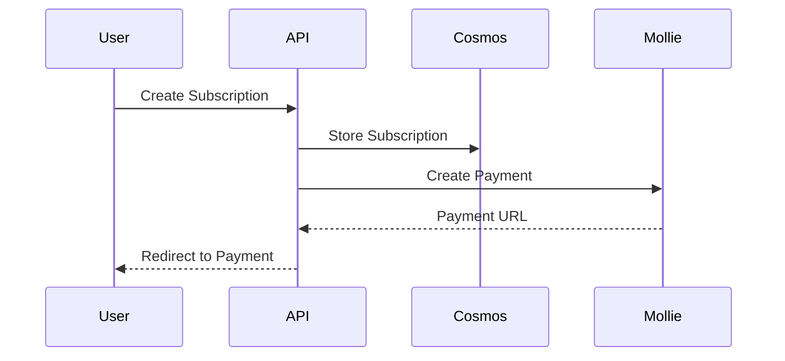

# RealmGrid Documentation - Copilot Instructions

## Project Overview
Technical documentation hub for the RealmGrid game server hosting platform. Contains architecture, infrastructure, billing, subscription, and operational documentation.

## Technology Stack
- **Format**: Markdown
- **Diagrams**: Mermaid, ASCII art
- **Structure**: Organized by domain/topic

## Code Quality Standards

### File Size & Structure
- **Maximum 250 lines per Markdown file** - Split large docs into logical sections
- Use clear hierarchy with H1-H4 headers
- Table of contents for files >100 lines
- Cross-reference related documents
- Keep code examples concise and focused

### Documentation Standards

#### File Organization
```
realm-documentation/
├── architecture/       # System design & components
├── billing/           # Payment & invoicing flows
├── infrastructure/    # Cloud resources & deployment
├── subscriptions/     # User lifecycle management
├── servers/          # Game server provisioning (if exists)
└── README.md         # Documentation index
```

#### Naming Conventions
- Files: `UPPER-KEBAB-CASE.md` for documents
- Folders: `lowercase-kebab-case/`
- Be descriptive: `SUBSCRIPTION-LIFECYCLE.md` not `SUB.md`
- Version docs if needed: `API-V2.md`

### Writing Guidelines

#### Structure Every Document
```markdown
# Title (H1 - One per document)

Brief 1-2 sentence overview.

## Table of Contents (for long docs)

## Overview

Detailed introduction and context.

## [Section Name]

Content with clear hierarchy.

## Related Documentation

- [Link to related doc](./path/to/doc.md)
```

#### Code Examples
- Include language identifier for syntax highlighting
- Keep examples under 50 lines
- Add comments for complex logic
- Show both request and response for API examples
- Use realistic but anonymized data

```python
# ✅ Good - Clear and concise
async def create_subscription(user_id: str, plan: str):
    """Create a new subscription for a user."""
    return await db.subscriptions.create({
        'userId': user_id,
        'plan': plan,
        'status': 'active'
    })
```

#### Diagrams
- Use Mermaid for sequence, flow, and component diagrams
- ASCII art for simple architecture overviews
- Keep diagrams focused on one concept
- Always include legend if symbols are used



### Documentation Types

#### Architecture Documents
- System components and their interactions
- Data flow diagrams
- Technology choices and rationale
- Scalability considerations
- Security architecture

#### Infrastructure Documents
- Cloud resources and configuration
- Deployment procedures
- Network topology
- Environment specifications (dev/test/acc/prod)
- CI/CD pipelines

#### Process Documents
- Step-by-step procedures
- Troubleshooting guides
- Runbooks for common operations
- Decision trees for problem resolution

#### API Documentation
- Endpoint definitions
- Request/response examples
- Error codes and handling
- Authentication requirements
- Rate limits

### Tables
- Use for structured data comparisons
- Include headers with proper alignment
- Keep columns under 8 for readability
- Use consistent formatting

```markdown
| Environment | Purpose       | URL                      |
|-------------|---------------|--------------------------|
| dev         | Development   | dev.realmgrid.com        |
| test        | Integration   | test.realmgrid.com       |
| prod        | Production    | realmgrid.com            |
```

### Links & References
- Use relative paths for internal docs: `[Setup](./SETUP.md)`
- Descriptive link text: `[deployment guide](../DEPLOYMENT.md)` not `[click here]`
- External links should include domain: `[Azure Docs](https://docs.microsoft.com/azure)`
- Verify links aren't broken before committing

### Version Control
- Document major changes at top of file with date
- Use semantic versioning for API docs
- Archive outdated documentation to `archive/` folder
- Don't delete - mark as deprecated if needed

### Security & Sensitive Information
❌ Never include:
- Passwords, API keys, secrets
- Personal identifiable information (PII)
- Connection strings with credentials
- Internal IP addresses (use placeholders)
- Real customer data

✅ Use placeholders:
```bash
# Good
az login --service-principal -u <CLIENT_ID> -p <CLIENT_SECRET>

# Bad
az login --service-principal -u abc123 -p secret456
```

### Code Quality in Docs
- Test all code examples before documenting
- Use syntax highlighting (```python, ```typescript, etc.)
- Show error handling in examples
- Include setup/prerequisites for runnable code
- Version pin important dependencies

### Consistency Rules
- **Dates**: Use ISO format `YYYY-MM-DD` or `December 9, 2025`
- **Commands**: Use code blocks with `bash` or `powershell` tag
- **Variables**: Use `<PLACEHOLDER>` or `${VARIABLE}` format
- **Quotes**: Use "double quotes" for UI elements, `backticks` for code
- **Lists**: Use `-` for unordered, `1.` for ordered (Markdown standard)

### Accessibility
- Provide alt text for images: ``
- Don't rely on color alone to convey information
- Use semantic Markdown (headers, lists, emphasis)
- Avoid ASCII art for critical information

### Maintenance
- Review documentation quarterly for accuracy
- Update after major feature releases
- Remove or update deprecated information
- Ensure examples work with current codebase
- Keep dependency versions current

### Anti-Patterns to Avoid
❌ Walls of text without headers  
❌ Outdated screenshots or examples  
❌ Broken links to moved/deleted files  
❌ Ambiguous procedural steps  
❌ Missing context for code examples  
❌ Over-complicated diagrams  
❌ Duplicate information across files  
❌ Leaving TODO comments unaddressed  

### Documentation Checklist
Before committing documentation:
- [ ] Spell-checked and grammar-checked
- [ ] Code examples tested and working
- [ ] Links verified (internal and external)
- [ ] Diagrams render correctly
- [ ] File under 250 lines (split if needed)
- [ ] Cross-references to related docs added
- [ ] No sensitive information included
- [ ] Clear and scannable structure

### Special File Types

#### README.md (Index Files)
- Brief project/section overview
- Quick links to main documentation
- Table for structured navigation
- Prerequisites or system requirements

#### CHANGELOG.md
- Keep reverse chronological (newest first)
- Group by version with date
- Use categories: Added, Changed, Fixed, Removed
- Link to PRs or issues if applicable

#### ARCHITECTURE.md
- High-level system overview
- Component interactions
- Technology stack with versions
- Design decisions and trade-offs

### Integration with Codebase
- Documentation changes should accompany code changes
- API changes require API doc updates
- New features need architectural documentation
- Infrastructure changes must update deployment docs

### MCP Server Documentation
- Document server capabilities clearly
- Include example queries
- Specify parameter types and requirements
- Show expected response formats
- List any limitations or known issues

## Related Repositories
- [realm-admin](../realm-admin/) - Admin dashboard
- [realm-web](../realm-web/) - Customer portal
- [realm-functions](../realm-functions/) - Azure Functions backend
- [realm-infra](../realm-infra/) - Infrastructure as Code
- [realm-e2e-tests](../realm-e2e-tests/) - Testing suite

## Questions & Support
Documentation should be clear enough to be self-service. If you need to explain the same thing multiple times, document it.
